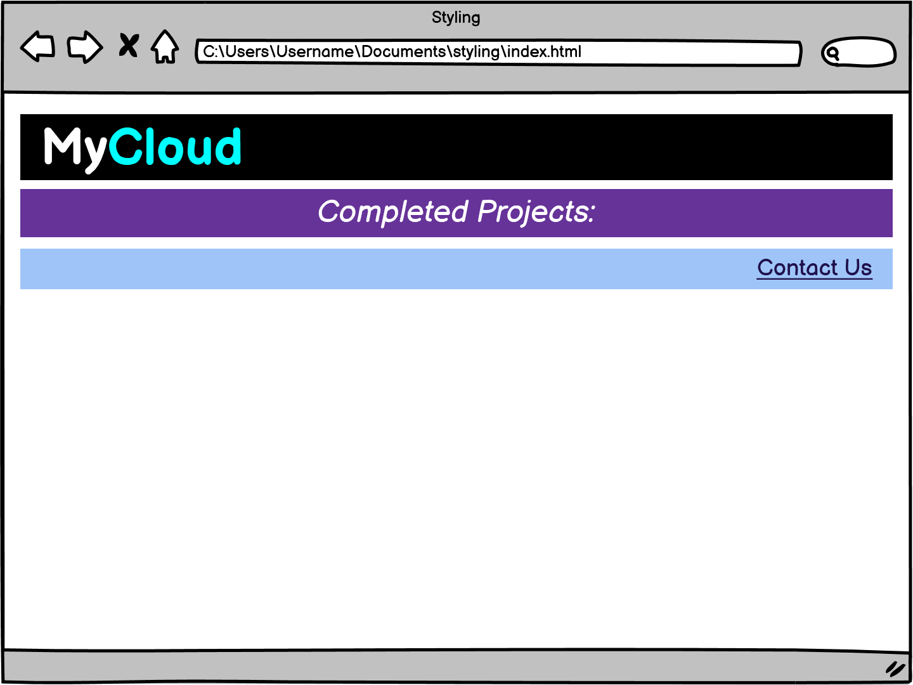

# Text Styling

## Coding Dojo Practice CSS

Objectives:


Use what we've learned about the ```color``` and ```background-color``` CSS properties

Use what we've learned about: ```text-align```, ```text-decoration```, and ```font-style CSS``` properties

Recreate the look of the ```h1```, ```h2```, and ```h3``` tags in the image below




Hint: we may need to use an additional ```<span>``` ```</span>``` element to wrap text inside of an ```<h1>``` ```</h1>``` that we would like to apply a different color to.
